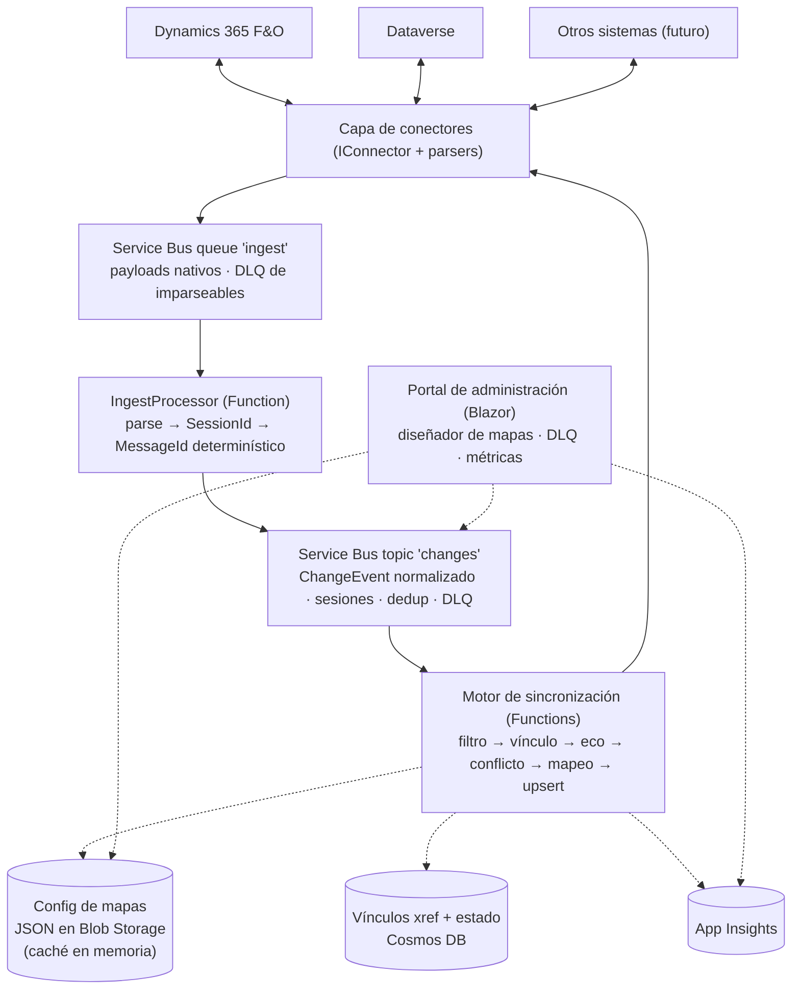

# AxxonAzureIntegrator — Arquitectura

Integrador de datos bidireccional near-real-time en Azure. Replica la funcionalidad de
Microsoft Dual Write (F&O ↔ Dataverse) pero desacoplado, extensible a cualquier sistema
y sin desarrollo sobre F&O.

## Decisiones de diseño

| # | Decisión | Razón |
|---|----------|-------|
| 1 | Sync **asíncrono near-real-time** (segundos), no síncrono como Dual Write | Resiliencia: si un destino está caído, los eventos esperan en la cola (ver decisión 11 para el mecanismo concreto). El modelo síncrono de Dual Write requiere hooks en el kernel de F&O y acopla la disponibilidad de ambos sistemas. Se acepta consistencia eventual. |
| 2 | Captura en F&O vía **data events nativos → Service Bus** | Cero desarrollo X++. F&O soporta Service Bus como endpoint de business/data events, con el secret en Key Vault. |
| 3 | Escritura en F&O vía **OData** sobre data entities | Tampoco requiere X++. Upsert idempotente con clave de entidad. |
| 4 | **Azure Service Bus** como backbone (no Event Grid solo) | Sesiones (orden por registro), dead-letter queue, duplicate detection, entrega programada (backoff). |
| 5 | **Sync inicial por DMF**, nunca por data events | Límite documentado: ~5.000 eventos/5 min y ~50.000/hora por ambiente F&O. |
| 6 | Mapas de entidades como **configuración versionada** (Blob Storage), no código | Un consultor configura una integración sin deploy. Equivalente a las table maps de Dual Write. |
| 7 | Tabla de **cross-reference de IDs** propia | Dual Write depende de GUIDs compartidos F&O/Dataverse; con un tercer sistema eso no existe. |
| 8 | Todo sistema se integra implementando **`IConnector`** | La extensibilidad más allá de F&O/Dataverse es objetivo de primer orden. |
| 9 | Estado de sync **por vínculo lógico** (par del xref), no por lado | Si el estado se guarda por `(sistema, registro)`, cada dirección solo ve su propia historia: el eco por contenido nunca dispara (esquemas distintos, claves distintas) y un conflicto real F&O↔Dataverse nunca se detecta. El vínculo — identificado por el `PairKey` del par de entidades — es la unidad donde eco y last-writer-wins tienen sentido. |
| 10 | **Cola de ingesta + re-publish normalizado** delante del topic | Los endpoints de business events de F&O y los service endpoints de Dataverse **no permiten estampar `SessionId` ni `MessageId`**; publicar directo a una suscripción con sesiones dejaría mensajes inconsumibles. El salto de ingesta parsea al `ChangeEvent` normalizado, estampa `SessionId` (orden por registro) y `MessageId` determinístico (dedup real), y aísla los payloads corruptos en su propia DLQ. |
| 11 | Errores **permanentes → DLQ directa; transitorios → re-encolado programado con backoff** | El trigger de Service Bus reintenta sin backoff (y las retry policies de Functions no aplican a este trigger): con el destino caído, `MaxDeliveryCount` se quema en segundos y todo termina en la DLQ — lo contrario de "esperar en la cola". El re-encolado con `ScheduledEnqueueTime` implementa la espera; el desorden que introduce lo absorbe el last-writer-wins. |
| 12 | Portal de administración en **Blazor**, referenciando `Core` directamente | El diseñador de mapas edita los mismos records `EntityMap`/`FieldMap` que consume el motor — misma validación, cero capa de traducción. Server-side habla con Cosmos/Service Bus/App Insights vía managed identity, sin API intermedia. Se descartó model-driven Power App: acoplaría el control plane a uno de los sistemas integrados, y la mitad operativa (DLQ, métricas) igual exigiría UI custom. |
| 13 | Mapas persistidos como **documentos JSON planos en Blob Storage** (integration keys compuestas incluidas) | Legibles, diffeables, portables entre ambientes (export/import = copiar el archivo — blob y archivo local son el mismo documento). El **versioning nativo del blob service** conserva la historia de cada guardado y los ETags dan concurrencia optimista, gratis; en Cosmos ambas cosas había que construirlas. Cosmos queda para lo que sí es trabajo de base de datos: xref y watermarks. Integration key como lista de campos del destino, paridad con Dual Write. |
| 14 | Escritura en Dataverse y F&O con **app registrations de Entra ID** (client credentials); managed identity para todo lo interno de Azure; secretos solo donde un tercero los impone, siempre en Key Vault | Una app registration por sistema, detrás de un application user (Dataverse) / usuario de servicio (F&O) con permisos acotados a las entidades de los mapas. Esa misma identidad es la que el sistema reporta como originador de nuestras escrituras → su ID alimenta la lista de usuarios de integración del `EchoGuard`: credencial de escritura y defensa primaria anti-loop son la misma cosa. |
| 15 | Mapas **agendados** (cron en el mapa): el run hace pull del origen y **publica al mismo topic `changes`**, nunca escribe directo al destino | Reusar el pipeline entero (sesiones por registro, eco, last-writer-wins, xref, histórico, DLQ) en vez de duplicarlo. La watermark (por mapa, en Cosmos) avanza cuando los eventos quedaron *encolados*: un run que muere a mitad re-trae el solapamiento y lo absorben la dedupe del topic y el upsert idempotente. Un timer único por minuto evalúa los crons (los timer triggers son estáticos al deploy) y encola runs en `scheduled-runs` — sesiones por mapa (nunca dos runs en paralelo del mismo mapa) + duplicate detection (ticks solapados no duplican). |

## Diagrama

## Flujo vivo (ejemplo F&O → Dataverse)

1. Un usuario modifica un cliente en F&O. El data event (activado sobre la data entity,
   con change tracking habilitado) se publica a la cola `ingest`. El payload tiene forma
   `RemoteExecutionContext` (operación en `MessageName`, campos en
   `InputParameters.Target`, `PreImage` en updates).
2. `IngestProcessor` (Function, sin sesiones) identifica el sistema origen, parsea con
   su `IChangeEventParser` al `ChangeEvent` normalizado y re-publica al topic `changes`
   con `SessionId = sistema:entidad:registro` y `MessageId` determinístico (mismo evento
   → mismo ID → el duplicate detection absorbe re-envíos). Un payload imparseable es
   error permanente y muere en la DLQ de `ingest`.
3. `ChangeEventProcessor` (Function con trigger de Service Bus, sesiones habilitadas)
   recibe el evento: dos cambios al mismo registro se procesan en orden.
4. `SyncPipeline` ejecuta por cada mapa activo:
   - **Filtro por empresa** (equivalente al filtro por legal entity de Dual Write).
   - **Resolución del vínculo**: el `IXrefStore` busca el `XrefLink` por
     `(PairKey, sistema, registro)`. El vínculo une los dos registros del par y carga
     el `SyncState` del último sync — compartido por ambas direcciones.
   - **Supresión de eco** (`EchoGuard`): descarta si lo originó el usuario de
     integración (defensa primaria), o si el evento viene del sistema donde el motor
     escribió por última vez y la proyección del payload sobre los campos escritos
     coincide en hash con lo escrito (defensa en profundidad).
   - **Conflictos**: last-writer-wins sobre el vínculo completo — el `OccurredAt` del
     evento se compara contra el del último escritor *de cualquiera de los dos lados*.
     Descarta rezagados y resuelve ediciones concurrentes F&O↔Dataverse.
   - **Mapeo** (`MappingEngine`): campos, value maps (option sets; sin traducción y sin
     default = error permanente), transformaciones con nombre, defaults.
   - **Upsert idempotente** vía el `IConnector` destino; si el vínculo no existía, el
     conector resuelve el registro existente por la **integration key** del mapa
     (campos del destino, posiblemente compuesta) antes de crear (Service Bus es
     at-least-once: nunca hacer create ciego).
   - **Actualizar el vínculo**: nuevo `SyncState` con el hash de *lo escrito* (esquema
     del destino), los campos escritos, y sistema/`OccurredAt` del escritor.
5. Excepciones transitorias (destino caído, throttling) → re-encolado programado con
   backoff exponencial; permanentes (config/datos inválidos) → DLQ inmediata con razón.
   La DLQ se revisa y reprocesa desde el portal de administración (fase 4).

## Vínculos y estado de sincronización (xref)

La unidad de estado es el **vínculo** (`XrefLink`): el par de registros que un par de
entidades mantiene sincronizados, identificado por `PairKey` (identidad canónica del
par, independiente de la dirección — los mapas A→B y B→A comparten `PairKey`).

El `SyncState` del vínculo guarda:

| Campo | Uso |
|-------|-----|
| `WrittenToSystem` | Un evento que llega *desde* este sistema es candidato a eco. |
| `WrittenFields` + `WrittenPayloadHash` | El evento-eco se proyecta sobre los campos escritos (mismo esquema: el del sistema que reporta) y se compara por hash. Clave ausente se proyecta como null — recupera el gotcha de F&O que omite datetimes NULL. |
| `LastWriterSystem` + `LastWriterOccurredAt` | Last-writer-wins entre sistemas. Un delete deja tombstone (vínculo con estado, sin campos) para que un update rezagado del otro lado no resucite el registro. |

Notas de diseño:

- **Precisión del last-writer-wins**: `OccurredAt` viene de relojes de dos sistemas
  distintos; el skew acota la precisión a segundos. Aceptable para consistencia
  eventual; ediciones simultáneas dentro de la ventana de skew se resuelven de forma
  arbitraria pero convergente (el estado del vínculo es uno solo).
- **Persistencia**: dos documentos espejo por vínculo en Cosmos (uno por lado), con
  partition key `lookupKey = pairKey|system|recordId` → point reads O(1) desde
  cualquier lado y distribución pareja durante el sync inicial. Consistencia entre
  espejos por ETag; las sesiones hacen único al escritor por lado, así que la
  contención real es solo entre direcciones y se resuelve con retry optimista.
- **Hash de contenido**: se calcula sobre el payload *mapeado* (lo que se escribió),
  nunca sobre el crudo del origen — un cambio en un campo no mapeado no genera tráfico.
  La normalización de representación de valores (números, fechas) entre lo escrito y lo
  que el sistema reporta queda para la fase 2; un falso negativo no pierde datos porque
  la defensa por identidad contiene el loop y el upsert es idempotente.

## Autenticación

Cuatro relaciones distintas; conviene no mezclarlas:

| Relación | Mecanismo | Identidad / secreto |
|----------|-----------|---------------------|
| F&O → cola `ingest` | F&O se autentica contra Service Bus con una app registration y exige la connection string del bus en **Key Vault** (Get/List para esa app). Único secreto inevitable del diseño: lo impone F&O. | App registration del endpoint de eventos + secret en KV |
| Dataverse → cola `ingest` | Service endpoint registrado con **SAS** dedicada, permiso *Send* solo sobre `ingest` (nunca la root key). | SAS policy `ingest-send` |
| Motor → Dataverse (Web API) y → F&O (OData) | **Client credentials** de una app registration por sistema (`EntraBearerHandler`: token cacheado, renovación con margen). En Dataverse: application user con rol acotado. En F&O: registrar la app en *Sys admin → Microsoft Entra applications* con un usuario de servicio. Scope = `{EnvironmentUrl}/.default`. | Secciones de config `Dataverse` / `FinOps` (`EnvironmentUrl`, `TenantId`, `ClientId`, `ClientSecret` vía KV, `IntegrationUserId`) |
| Motor y portal → Azure (Service Bus, Cosmos, Blob, KV, App Insights) | **Managed identity** (conexión identity-based, sin connection strings). Roles pendientes: SB Data Receiver/Sender, Cosmos Built-in Data Contributor, Storage Blob Data Contributor (mapas), KV Secrets User. El portal suma auth de usuarios: Entra ID, roles viewer/operator (fase 4). | Identidad system-assigned de cada app |

El `IntegrationUserId` de cada app registration (systemuserid del application user en
Dataverse, usuario de servicio en F&O) se inyecta en el `EchoGuard` al componer los
hosts: los eventos-eco que nuestras escrituras generan vienen firmados por esas
identidades. Sin credenciales configuradas, los hosts arrancan igual (desarrollo
local): el error claro aparece recién al usar un conector.

Endurecimiento futuro (sin cambio de código): reemplazar los client secrets por
**federated identity credentials** — la managed identity del host federada a la app
registration — y el esquema queda completamente secretless salvo el endpoint de F&O.

## Portal de administración

Proyecto Blazor (`Axxon.Integrator.AdminPortal`) que referencia `Core`: edita los
mismos records que consume el motor, con la misma validación. Tres áreas:

- **Diseñador de mapas** (estilo table maps de Dual Write): campos de cada lado
  ofrecidos desde la metadata real de los conectores (`GetMetadataAsync`, con
  degradación a entrada manual mientras no esté implementada), transformaciones
  registradas en el `MappingEngine`, value maps para option sets, defaults, filtro por
  empresas, e **integration key compuesta** elegida entre los campos destino mapeados.
  Guardar incrementa la versión y persiste el documento JSON (vista previa del JSON en
  la propia UI; el archivo local de desarrollo y el blob de producción son el mismo
  documento — el blob service además conserva cada versión anterior).
- **Dead-letter**: listar/inspeccionar/reprocesar. El reproceso re-publica el mensaje
  al camino normal (cola `ingest` o topic según de dónde venga): el last-writer-wins y
  la supresión de eco lo protegen de duplicar o pisar datos nuevos. La UI orquesta; no
  hay lógica de negocio nueva.
- **Métricas**: KQL a App Insights — latencia de punta a punta por CorrelationId,
  throughput contra el límite de data events de F&O, ecos suprimidos, conflictos,
  profundidad de DLQs.

Autenticación Entra ID con roles viewer/operator (pendiente). Acceso a Azure con la
managed identity del portal, sin API intermedia.

## Mapeos agendados

Además de reaccionar a data events, un mapa puede llevar un `Schedule` (cron NCRONTAB
en UTC, 5 o 6 campos — el formato de los timer triggers): un pull periódico del origen
que entra al motor por la misma puerta que los eventos. Casos de uso: entidades sin
eventos, reconciliación de eventos perdidos, y deletes que el origen no publica.

Flujo: `ScheduleDispatcher` (timer, 1 min, stateless) evalúa el cron de cada mapa
activo → encola `ScheduledRunRequest` en la cola `scheduled-runs` (SessionId = mapa,
MessageId = mapa + ocurrencia) → `ScheduledRunProcessor` ejecuta el
`ScheduledRunService` de Core: pull desde la watermark → publica cada `ChangeEvent` al
topic `changes` con las convenciones de la ingesta (`ChangeEventMessages`) → detección
de deletes → guarda la watermark (por mapa: `map:<nombre>`, contenedor `watermarks`
de Cosmos / archivos en local).

Dos modos por mapa:

- **Incremental**: F&O no expone change tracking por OData, así que el pull filtra por
  `ModifiedDateTime ge <watermark>` con `cross-company=true` (token = ISO 8601 del
  máximo visto; borde inclusivo — repetir es barato, perder no). Requiere que la
  entidad exponga `ModifiedDateTime`.
- **FullExport**: re-publica todo el origen en cada run (tablas de referencia chicas,
  o entidades sin `ModifiedDateTime`).

**Deletes por ausencia** (`DetectDeletes`): el polling no ve tombstones, así que el run
barre las claves vivas del origen (keys-only, **sin filtro de empresa**: la ausencia
debe ser absoluta o los registros fuera del scope parecerían borrados) y las compara
contra `GetLinksForPairAsync` del xref — lo que el xref conoce del lado origen y ya no
existe se publica como `Delete` (OccurredAt = ocurrencia del cron; los tombstones del
xref evitan re-emitir). Los deletes viajan sin `Company` y el filtro de empresas del
pipeline los deja pasar a propósito. Reservarlo para entidades de volumen acotado.

Identidad de registros F&O: el pull identifica por el **segmento de clave OData
canónico** (partes ordenadas por nombre de campo: `CustomerAccount='C001',dataAreaId='usmf'`),
el mismo que persiste el xref cuando F&O es destino — así upsert y poll comparten
vínculo. Ojo: los data events identifican por GUID (`PrimaryEntityId`) y suelen usar
otro nombre de entidad (`mserp_*`), por lo que un mapa event-driven y uno agendado
sobre la misma entidad viven en espacios de identidad (PairKey) distintos.

## Sync inicial + cutover

1. Activar la captura de eventos **antes** de la copia masiva (los cambios durante la
   copia quedan encolados).
2. Bulk copy con `ExportAsync` del conector origen (F&O: DMF package API; Dataverse:
   Web API paginada), orquestado con Durable Functions.
3. Al terminar, drenar la cola: el last-writer-wins del pipeline descarta los eventos
   más viejos que el registro copiado.

## Restricciones conocidas (documentación oficial)

- Data events F&O: ~5.000 eventos/5 min, ~50.000/hora por ambiente. Updates más caros
  que creates/deletes. Dimensionar y alertar sobre este límite.
- Change tracking **obligatorio** en la data entity para que los data events disparen.
- Los datetime en NULL **se omiten** del payload del data event → el motor de mapeo
  trata "clave ausente" ≠ "valor null" y nunca pisa el destino por ausencia; el
  EchoGuard proyecta ausente-como-null al comparar.
- Los endpoints de eventos de F&O y Dataverse **no estampan `SessionId`/`MessageId`**
  → de ahí la cola de ingesta (decisión 10). Validar con un spike temprano el formato
  exacto que cada uno entrega en la cola.
- F&O tiene retry propio + log de errores con "Resend" para fallos de entrega al bus
  (el `MessageId` determinístico de la ingesta dedupea esos re-envíos).
- Endpoint de Service Bus en F&O requiere: namespace propio (tier Standard+ para
  topics), secret en Key Vault, app registration de Entra ID con acceso Get/List.
- Las retry policies de Azure Functions **no aplican al trigger de Service Bus**: el
  backoff se implementa re-encolando con `ScheduledEnqueueTime` (decisión 11).
- Catch-up por polling contra F&O: OData no expone change tracking incremental
  directo. `PullChangesAsync` filtra por `ModifiedDateTime` (ver "Mapeos agendados");
  para volúmenes que ese filtro no aguante, evaluar DMF incremental / recurring
  integrations.

## Estructura de la solución

| Proyecto | Rol |
|----------|-----|
| `Axxon.Integrator.Core` | Contratos (`IConnector`, stores), modelos (`ChangeEvent`, `EntityMap`, `XrefLink`), motor (`SyncPipeline`, `MappingEngine`, `EchoGuard`). Sin dependencias de Azure: testeable unitariamente. |
| `Axxon.Integrator.Connectors.FinOps` | Parser de data events + escritura OData + export DMF. |
| `Axxon.Integrator.Connectors.Dataverse` | Parser de service endpoints + escritura Web API + change tracking. |
| `Axxon.Integrator.SyncEngine` | Azure Functions (isolated, .NET 8): `IngestProcessor` (normaliza y estampa sesión/dedup), `ChangeEventProcessor` (ejecuta el pipeline), `ScheduleDispatcher` (timer que evalúa los crons) y `ScheduledRunProcessor` (ejecuta los runs agendados). |
| `Axxon.Integrator.AdminPortal` | Blazor (server): diseñador de mapas, DLQ, métricas. Referencia `Core` — mismos modelos y validación que el motor. |
| `Axxon.Integrator.Azure` | Infraestructura Azure compartida: auth Entra (`EntraAppOptions`, `EntraBearerHandler`), `BlobEntityMapStore`, `CosmosXrefStore`, `CosmosWatermarkStore`, `TableSyncHistoryStore`. |
| `infra/` | Bicep: Service Bus (colas `ingest` y `scheduled-runs` + topic `changes`), Cosmos DB (xref, watermarks), Blob Storage (mapas, con versioning), Function App, Key Vault, App Insights. Falta: App Service del portal. |

## Fases

1. **MVP unidireccional**: Dataverse → F&O, una entidad (clientes). Valida el pipeline
   completo, incluida la ingesta (spike del formato real de los payloads) y la
   clasificación de errores permanente/transitorio. El diseñador de mapas ya existe en
   esqueleto; los mapas del MVP pueden crearse con él (JSON local).
2. **Bidireccional**: F&O → Dataverse + eco + conflictos sobre el estado por vínculo.
   Endurecer la normalización de valores del hash de contenido. **Consola operativa
   mínima** en el portal (DLQ: ver + reprocesar; pausar/reanudar mapas) — no esperar a
   la fase 4: es lo primero que se necesita con el MVP vivo.
3. **Sync inicial** con cutover (DMF / Durable Functions).
4. **Portal completo**: métricas, auth Entra ID (viewer/operator), App Service en
   Bicep, ETag condicional al guardar mapas (multiusuario). (La metadata en vivo de
   ambos conectores y el store de mapas en blob ya están implementados.)
5. **Tercer conector** (SQL o REST genérico): prueba de fuego de la abstracción `IConnector`.
