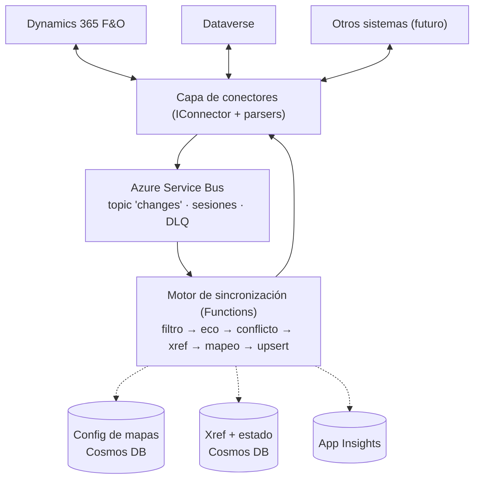

# AxxonAzureIntegrator — Arquitectura

Integrador de datos bidireccional near-real-time en Azure. Replica la funcionalidad de
Microsoft Dual Write (F&O ↔ Dataverse) pero desacoplado, extensible a cualquier sistema
y sin desarrollo sobre F&O.

## Decisiones de diseño

| # | Decisión | Razón |
|---|----------|-------|
| 1 | Sync **asíncrono near-real-time** (segundos), no síncrono como Dual Write | Resiliencia: si un destino está caído, los eventos esperan en la cola. El modelo síncrono de Dual Write requiere hooks en el kernel de F&O y acopla la disponibilidad de ambos sistemas. Se acepta consistencia eventual. |
| 2 | Captura en F&O vía **data events nativos → Service Bus** | Cero desarrollo X++. F&O soporta Service Bus Topic/Queue como endpoint de business/data events, con el secret en Key Vault. |
| 3 | Escritura en F&O vía **OData** sobre data entities | Tampoco requiere X++. Upsert idempotente con clave de entidad. |
| 4 | **Azure Service Bus** como backbone (no Event Grid solo) | Sesiones (orden por registro), dead-letter queue, duplicate detection. |
| 5 | **Sync inicial por DMF**, nunca por data events | Límite documentado: ~5.000 eventos/5 min y ~50.000/hora por ambiente F&O. |
| 6 | Mapas de entidades como **configuración versionada** (Cosmos DB), no código | Un consultor configura una integración sin deploy. Equivalente a las table maps de Dual Write. |
| 7 | Tabla de **cross-reference de IDs** propia | Dual Write depende de GUIDs compartidos F&O/Dataverse; con un tercer sistema eso no existe. |
| 8 | Todo sistema se integra implementando **`IConnector`** | La extensibilidad más allá de F&O/Dataverse es objetivo de primer orden. |

## Diagrama

## Flujo vivo (ejemplo F&O → Dataverse)

1. Un usuario modifica un cliente en F&O. El data event (activado sobre la data entity,
   con change tracking habilitado) se publica al topic `changes` de Service Bus. El
   payload tiene forma `RemoteExecutionContext` (operación en `MessageName`, campos en
   `InputParameters.Target`, `PreImage` en updates).
2. `ChangeEventProcessor` (Function con trigger de Service Bus, sesiones habilitadas)
   recibe el mensaje. El `SessionId` es el ID del registro → dos cambios al mismo
   registro se procesan en orden.
3. El parser del sistema origen lo convierte a `ChangeEvent` normalizado.
4. `SyncPipeline` ejecuta por cada mapa activo:
   - **Filtro por empresa** (equivalente al filtro por legal entity de Dual Write).
   - **Supresión de eco** (`EchoGuard`): descarta si lo originó el usuario de
     integración, o si el hash del payload coincide con el último estado sincronizado.
   - **Conflictos**: last-writer-wins por `OccurredAt`; un evento más viejo que el
     último sync se descarta como rezagado.
   - **Resolución de identidad**: el `IXrefStore` traduce el ID origen al ID destino;
     si no existe, el conector destino resuelve por clave natural antes de crear.
   - **Mapeo** (`MappingEngine`): campos, value maps (option sets), transformaciones
     con nombre, defaults.
   - **Upsert idempotente** vía el `IConnector` destino (Service Bus es at-least-once:
     el mismo mensaje puede llegar dos veces, nunca hacer create ciego).
   - Actualizar xref y `SyncState` (hash + timestamp).
5. Excepciones → reintentos de Service Bus → DLQ al agotarse. La DLQ se revisa y
   reprocesa desde el portal de administración (fase 4).

## Sync inicial + cutover

1. Activar la captura de eventos **antes** de la copia masiva (los cambios durante la
   copia quedan encolados).
2. Bulk copy con `ExportAsync` del conector origen (F&O: DMF package API; Dataverse:
   Web API paginada), orquestado con Durable Functions.
3. Al terminar, drenar la cola: el last-writer-wins del pipeline descarta los eventos
   más viejos que el registro copiado.

## Restricciones conocidas (documentación oficial)

- Data events F&O: ~5.000 eventos/5 min, ~50.000/hora por ambiente. Updates más caros
  que creates/deletes. Dimensionar y alertar sobre este límite.
- Change tracking **obligatorio** en la data entity para que los data events disparen.
- Los datetime en NULL **se omiten** del payload del data event → el motor de mapeo
  trata "clave ausente" ≠ "valor null" y nunca pisa el destino por ausencia.
- F&O tiene retry propio + log de errores con "Resend" para fallos de entrega al bus.
- Endpoint de Service Bus en F&O requiere: namespace propio (tier Standard+ para
  topics), secret en Key Vault, app registration de Entra ID con acceso Get/List.

## Estructura de la solución

| Proyecto | Rol |
|----------|-----|
| `Axxon.Integrator.Core` | Contratos (`IConnector`, stores), modelos (`ChangeEvent`, `EntityMap`), motor (`SyncPipeline`, `MappingEngine`, `EchoGuard`). Sin dependencias de Azure: testeable unitariamente. |
| `Axxon.Integrator.Connectors.FinOps` | Parser de data events + escritura OData + export DMF. |
| `Axxon.Integrator.Connectors.Dataverse` | Parser de service endpoints + escritura Web API + change tracking. |
| `Axxon.Integrator.SyncEngine` | Azure Functions (isolated, .NET 8): triggers de Service Bus, composición DI. |
| `infra/` | Bicep: Service Bus, Cosmos DB, Function App, Key Vault, App Insights. |

## Fases

1. **MVP unidireccional**: Dataverse → F&O, una entidad (clientes). Valida el pipeline completo.
2. **Bidireccional**: F&O → Dataverse + eco + conflictos.
3. **Sync inicial** con cutover (DMF / Durable Functions).
4. **Portal de administración**: pausar/reanudar mapas, DLQ, reprocesos, métricas.
5. **Tercer conector** (SQL o REST genérico): prueba de fuego de la abstracción `IConnector`.
